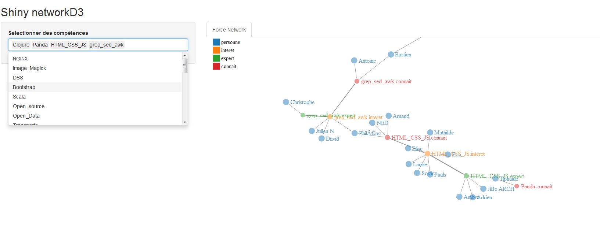

# Références

* [D'après l'idée originale de Sébastien Kurt](http://movilab.org/index.php?title=La_Bulloterie)
* [Conception et implémentation de l'application](https://github.com/phileas-condemine/bulloterie) par [Philéas Condemine](mailto:phileas.condemine@gmail.com)

# Utilisation

Cette application propose d'explorer les relations entre participants de la bulloterie selon plusieurs axes :

* Analyse des centres d'intérêt d'un ou plusieurs participants
    * choix d'un concept (intérêt, expert, connaît...)
    * tous les concepts
* Analyse d'un ou plusieurs centres d'intérêt pour tous les participants et tous les concepts

# Amélioration

Cf issues

